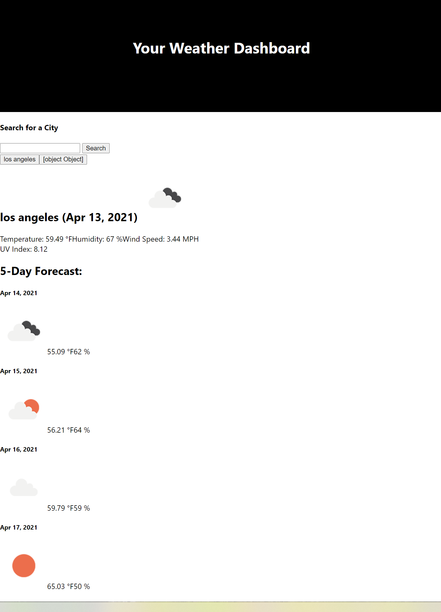

# Weather Dashboard

## Description

The Weather Dashboard is a project focused on using server-side api. Cities are saved using localStorage and when a city is search, the daily details and a 5-day forcast are presented.  I need to go back and add more styling to the project.

## Table of Contents
* [Installation](#installation)
* [Questions](#questions)

## Screenshot

## Questions  

Feel free to checkout my other projects https://github.com/nrhuizar
Or you can reach me @ nrhuizar@gmail.com
